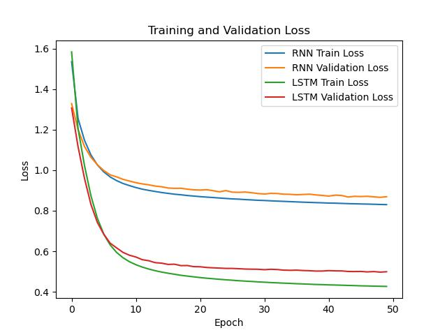

Artificial Neural Networks and Deep Learning course, 2024 Spring, Graduate School of Seoul National University of Science and Technology
# Assignment \#2 CharRNN, CharLSTM

## Q1
```
You should write your own pipeline to provide data to your model. Write your code in the template dataset.py. 
```
[Custom Dataset API Code](./template/dataset.py)

## Q2
```
Implement vanilla RNN and LSTM models in model.py. Some instructions are given in the file as comments. Stack some layers as you want if it helps the improvement of model's performance.
```
[CharRNN, CharLSTM Model Code](./template/model.py)

## Q3
```
Write main.py to train your models. Here, you should monitor the training process using average loss values of both training and validation datasets.
```
[Model Training Code](./template/main.py)

## Q4
```
(Report) Plot the average loss values for training and validation. Compare the language generation performances of vanilla RNN and LSTM in terms of loss values for validation dataset. 
```


Due to short-term memory and gradient vanishing problems, RNN showed low performance than LSTM. 

## Q5
```
Write generate.py to generate characters with your trained model. Choose the model showing the best validation performance. You should provide at least 100 length of 5 different samples generated from different seed characters. 
```
[Generate Code](./template/generate.py)

## Q6
```
(Report) Employ at least more than two regularization techniques to improve LeNet-5 model. You can use whatever techniques if you think they may be helpful to improve the performance. Verify that they actually help improve the performance. Keep in mind that when you employ the data augmentation technique, it should be applied only to training data. So, the modification of provided MNIST class in dataset.py may be needed.
```
1. **RNN(T=0.8)**</br>
    **Seed: H</br>**
    HASTINGS:
    Come, come, you have made for my country with me untor, body,
    But now, not Coriolanus.

    Fir

    **Seed: T </br>**
    TUS:
    Let's to the Capitol!

    BRUTUS:
    Pray, let us all too.

    MENENIUS:
    I hope the kindee, then, Lord;
    A

    **Seed: W</br>**
    When he wakes: but I do request your voices,
    To send thoughts, a letter from you.

    First Murderer:
    O 

    **Seed: A</br>**
    And almost should be long;
    And when the king myself: 'tis no set them grown to me, so press honour to

    **Seed: M</br>**
    Make princely Buckingham, no more.

    CORIOLANUS:
    No, I would be it stamp,
    In human and not the icjoit,

2. **RNN(T=0.6)</br>**
    **Seed: H</br>**
    HAM:
    Good Carquish him our commanding glory wife, he did cloth in the middle and love thee age,
    You m

    **Seed: T</br>**
    To bear 'twill do their truth,
    We have some other say unto your noble lords, make a mother jealous pi

    **Seed: W</br>**
    With whom we have said false-bable strokes, and mother,
    Who shall show themselves,
    As loath to death,

    **Seed: A</br>**
    And treasure from at all will they be presently repair to the Capitol!

    BRUTUS:
    Being moved, that the

    **Seed: M</br>**
    Marcius did fight
    While through more.

    First Senator:
    The god of his angry poor heart
    Than when I met

3. **RNN(T=0.4)</br>**
    Seed: H</br>
    His good straight to the Tower.

    GLOUCESTER:
    But he stand naked, and I could love me dear a
    vilege;
    A

    **Seed: T</br>**
    Thou hast act with those that have revenged on him thanks: I will face is slain?
    What say you, uncle,

    **Seed: W</br>**
    Which he could displeasure of the word.

    GLOUCESTER:
    Why, my uncle those this surder to death,
    And mo

    **Seed: A</br>**
    And then I'll leave you.--
    Come, when he cannot over their scarce, to begin to tellinate.

    BRUTUS:
    Co

    **Seed: M</br>**
    Margaret's curse against your hands: what's the matter, you are not worshipful as the ride;
    Why, here

4. **RNN(T=0.2)</br>**
    Seed: H</br>
    HASTINGS:
    O bloody princely be lord thing: what noise of his house, or else to guers and
    To meet, the

    **Seed: T</br>**
    Thou hast accused in true rest;
    And so do I;
    I for a Clarence, as I loved us the city mind;
    Laid the 

    **Seed: W</br>**
    When he was your defenders, and look'd deadly son, which would be so.

    CORIOLANUS:
    What then?
    As thou

    **Seed: A</br>**
    And then I'll speak with Coriolanus.

    MENENIUS:
    What should but his trembling nature,
    That shall the 

    **Seed: M</br>**
    Marry, my lord, as pronounced your power in men, in all thing
    Master's faces,
    But had mercus writ, ou


Temperature plays a crucial role in controlling the diversity and quality of the generated output.</br>
At **low temperature**, the model tends to generate more deterministic predictions by selecting the most probable characters for the next sequence. Consequently, the generated text tends to be more coherent and predictable.</br>
At **high temperature**, the model tends to generate more diverse and creative output. The predictions become less deterministic, resulting in a more uniform distribution of characters and allowing for a wider range of possible outcomes.</br>
**By adjusting the temperature, model can generate balanced text between coherence and creatividy.**
